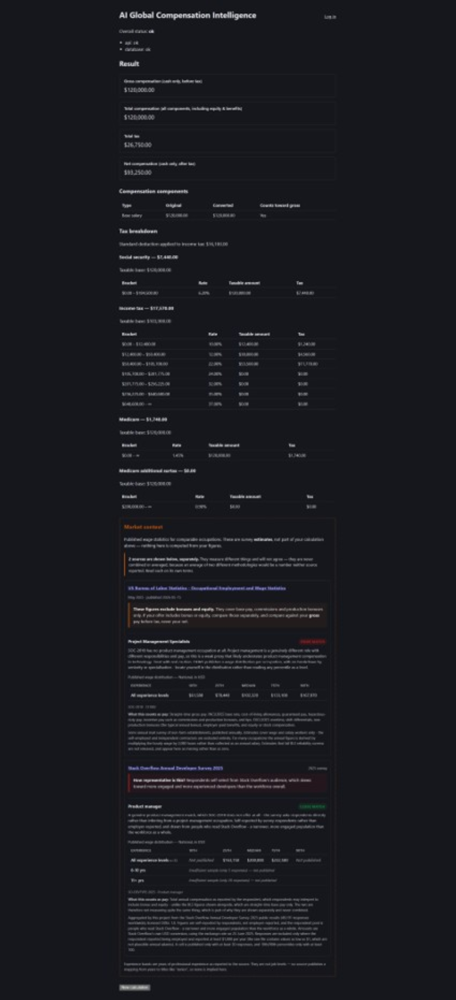
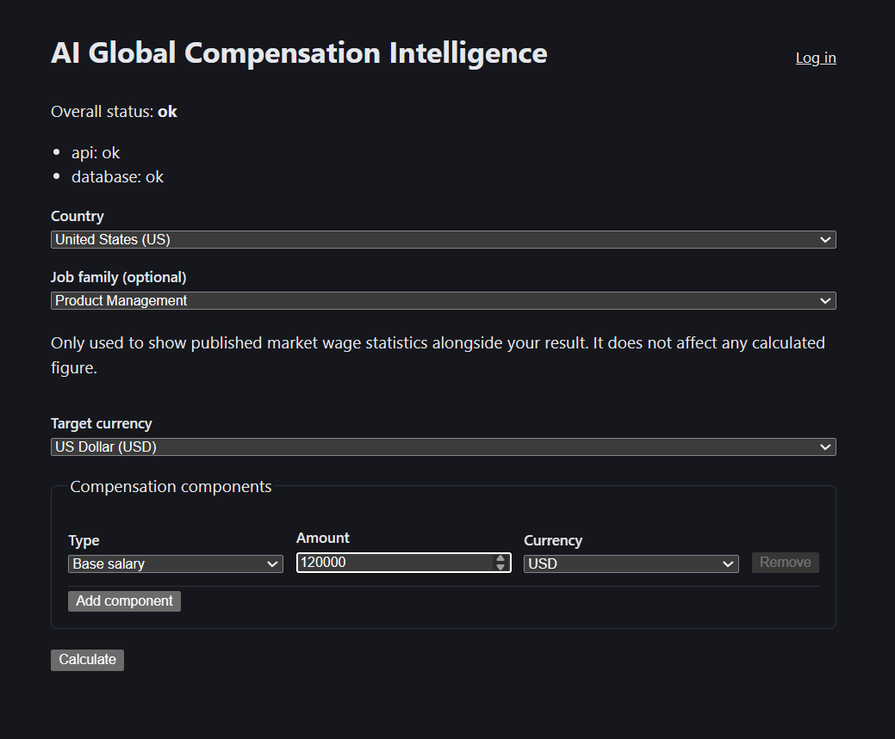

# AI Global Compensation Intelligence

**A tax-aware compensation calculator and negotiation tool for India, the US
and Spain.** Salary sites skew toward large employers, and asking an LLM what
a role pays produces numbers that are confident, specific, and often wrong.
This computes take-home pay deterministically from published government tax
data, shows market context from cited statistical sources, and keeps every
AI-generated word structurally separated from every number.



*One continuous page: a real US $120,000 calculation, its full per-bracket tax
breakdown, and market context from two sources shown separately. Note the
match-quality labels — BLS offers only a **poor match** for product management
(SOC-2018 has no such occupation), while the survey has a **close match**. The
tool says which is which rather than presenting both as equally applicable.*

## What makes this different

- **A deterministic tax engine that is fully data-driven per country** —
  brackets, thresholds and deductions live in the database, and there is zero
  country-specific branching anywhere in the application code.
- **An AI layer that structurally cannot state a number the engine didn't
  compute** — every generated figure is extracted and verified against the
  grounded data *after* generation, so the guarantee is post-hoc
  verification rather than a prompt politely asking the model to behave.
- **Two independent market data sources, shown separately and never
  averaged**, each with its own methodology, sample sizes, and suppression
  thresholds that withhold any figure too thinly sampled to mean anything.
- **Every figure traceable to a cited government or published source** —
  tax brackets, exchange rates and wage statistics all carry their origin,
  collection period and known limitations.

## What this process caught

Building this with real verification at every step — real API calls, real
database rows, the actual running app — surfaced a series of bugs that tests
alone did not. They are worth reading not as a list of mistakes, but as what
a verification discipline actually catches, and what would have shipped
without it.

**A silent ₹0.00 tax result.** The engine compared an already-converted gross
against tax brackets denominated in a different currency. It was unreachable
for three phases because every test happened to use a target currency equal to
the tax currency. The first genuine cross-currency calculation — ₹1,500,000
viewed in EUR — returned a total tax of `0.00`. It didn't crash or raise; it
returned a plausible, completely wrong answer. ([`6a4377f`](../../commit/6a4377f))

**An AI safeguard defeatable by its own system prompt.** The system prompt
contains `"150,000"` as an instructional example of formatting. Had the
consistency checker built its ground truth from the system and user prompts
combined, any hallucinated $150,000 figure would have validated against the
prompt's own example. Found by deliberately treating the prompt as adversarial
input *before* writing the checker.

**The same bug class one layer deeper.** When the checker rejects a response,
the retry prompt names the fabricated number so the model can correct itself.
Checking attempt two against *that* prompt would have laundered a repeated
fabrication into "verified". Caught by a test that deliberately repeats the
fabrication.

**A safeguard failing closed, not open.** The checker's number regex misparsed
a legitimately restated date — `2026-08-16` — as a negative number, and
rejected a fully accurate response twice, live in the browser. Only a real API
call surfaced it; every mocked test passed. ([`96cf1e0`](../../commit/96cf1e0))

**A rate limiter that would have collapsed to a single shared bucket in
production.** It keyed on the direct TCP peer, which behind the project's own
nginx config is always loopback — so every user in the world would have shared
one limit. Found by reading the deployed proxy config against the library's
actual source rather than its documentation.

**A feature that would have shipped completely dead.** The market context
panel could never render, because the calculator form never collected the job
family ID it needs. Every test passed — the tests supplied the ID directly.
Found by opening the running app and looking at it.

**A filter that nearly selected students.** An "employed full-time" filter
matched `"Attending school (full-time)"` on a substring, quietly selecting the
wrong population and dragging a median from $150,000 to $67,500. Caught by
measuring the filter's effect instead of trusting that it did what it said.

Every one of these was caught before shipping, by process rather than luck.
The recurring pattern is that each was invisible to the test suite and visible
the moment something real ran.

## The AI layer, and the comparison view

The AI explains figures the engine computed. It never produces one. Every
number in its output is extracted after generation and checked against the
grounded data; unverifiable text is regenerated or withheld rather than shown.

Saved calculations can also be normalised into a single currency and compared,
with the exchange rate and its ECB source shown alongside the gaps.

Neither of these is screenshotted — capturing the AI panel means spending a
real API call on a shot whose interesting part is a disclaimer, and both
features are covered by the tests and described above. See
[`docs/screenshots/`](docs/screenshots/) for what is captured and why.

<details>
<summary><strong>Build history (phases 1–11)</strong> — how it was built, one increment at a time</summary>

Each phase was built, verified against something real, and committed before
the next began. Kept because the sequence shows the reasoning, not just the
result.

- **Phase 1 — walking skeleton.** FastAPI backend with a liveness/readiness
  health check, React/Vite frontend, PostgreSQL wired locally, CI (lint,
  type-check, test, build, dependency audit) gating every PR, and deployment
  artifacts (systemd unit, Nginx config, CD workflow) written and validated
  locally.
- **Phase 2 — reference data.** Country/currency/exchange-rate/job-family/
  experience-level/employment-type/tax-rule-set/tax-bracket models, an
  idempotent seed mechanism, and real, cited income-tax data for India, the
  US, and Spain, with every simplification explicitly flagged rather than
  left implicit. Read-only endpoints: `GET /api/v1/countries`,
  `GET /api/v1/countries/{code}/tax-rule-sets`.
- **Phase 3 — deterministic calculation engine.** Pure, DB-free currency
  conversion and progressive tax-bracket math (unit-tested against
  hand-worked boundary cases), an orchestration layer that runs them against
  real seeded data, and `POST /api/v1/calculations`. Hand-verified against
  real salary figures in all three seeded countries — e.g. a $150,000 US
  single-filer example checked bracket-by-bracket by hand.
- **Phase 4 — usable frontend.** A real page where someone can enter a
  compensation offer (one or more components — base, bonus, equity, benefit,
  allowance — each with its own amount and currency), pick a country and,
  where more than one applies, a tax regime, submit it, and see the
  computed gross, total compensation, full tax breakdown, and net rendered
  clearly. TypeScript types are generated from the backend's own OpenAPI
  schema rather than hand-duplicated, so frontend and backend contracts
  can't silently drift.

- **Phase 5 — auth.** Argon2id password hashing, JWT access tokens with
  opaque, revocable refresh tokens, and saved calculation history.
- **Phase 6 — real exchange rates.** A provider interface with a
  Frankfurter adapter pinned to ECB reference rates, and a scheduled,
  idempotent ingestion script.
- **Phase 7 — offer comparison.** Normalize several saved calculations into
  one currency and show the gaps between them.
- **Phase 8 — AI negotiation insight.** A provider interface (Gemini and
  Anthropic adapters, switchable by env var), versioned prompt templates,
  and — the part that matters — a post-hoc numeric-consistency checker that
  extracts every number from the model's output and verifies it traces back
  to the grounded data, regenerating or refusing rather than showing
  unverified figures. The AI never computes a number.
- **Phase 9 — production hardening.** Rate limiting on auth and
  cost-sensitive endpoints, security headers, explicit timeouts on every
  external call, a secret-leak sweep, and real request-ID tracing through
  the logs.
- **Phase 10 — market context.** Published US wage distributions (BLS OEWS)
  shown beside a calculation, kept structurally separate from computed
  figures.
- **Phase 11 — second market source.** The Stack Overflow Developer Survey
  added alongside BLS, closing Phase 10's two honest gaps: India and Spain
  now have market data, and every country has a years-of-experience
  breakdown. Sources are shown separately and never averaged, and cells
  with too few responses are suppressed and labelled rather than published
  thin — see [Market data coverage](#market-data-coverage).

</details>

Nothing is deployed to a real server yet — see [Deployment](#deployment).

## Market data coverage

Market compensation figures are **statistical estimates**, not facts like a tax
bracket or a published exchange rate. They carry a sample, a methodology, real
uncertainty, and a shelf life. This project keeps that distinction
structurally: market data has no foreign key into the calculation pipeline,
provenance columns are mandatory, and the UI renders distributions with their
source and caveats rather than a single confident number.

Two sources are ingested. They are shown **separately and never combined** —
see [Why the two sources disagree](#why-the-two-sources-disagree).

| Country | BLS OEWS | Stack Overflow Survey | Seniority breakdown |
| --- | --- | --- | --- |
| United States | Yes — full percentiles | Yes — 4,488 responses | Yes |
| India | No | Yes — 898 responses | Yes (pooled) |
| Spain | No | Yes — 453 responses | Yes (pooled) |

Sample counts are responses remaining after the disclosed filter, from the
2025 survey release (49,191 responses worldwide).

### Suppression: when a cell is not published

A percentile computed from four responses is noise wearing a statistic, so
cells are withheld rather than published thin. Following BLS's own precedent
of suppressing estimates that fail its reliability screens:

| Sample size | What is published |
| --- | --- |
| under 30 | **Nothing.** Shown as "insufficient sample" with the count, never silently omitted |
| 30–99 | Median and 25th/75th percentiles |
| 100+ | Adds 10th and 90th percentiles |

Tails need more data than the centre — at n=30 a 10th percentile rests on
roughly three observations. A withheld figure is always shown as withheld: an
invisible gap looks like no gap at all.

### Survey filter, and why it changes the numbers

Two exclusions, both disclosed on every figure they affect:

1. **Employed respondents only** — students, the unemployed, the retired and
   freelancers report figures that are not comparable salaried wages.
2. **At least $1,000/yr** — the raw file genuinely contains values of $1, and
   1.3–3.8% of responses fall below $1,000, which is not a plausible annual
   salary in any covered country.

Measured effect: medians barely move (US stays at $150,000) while contaminated
tails clean up (US 10th percentile $62,640 → $80,000). That is the signature
of removing junk, not of reshaping a distribution.

### Why the two sources disagree

They measure different things, and for US software roles the gap is large:

| | BLS OEWS | Stack Overflow Survey |
| --- | --- | --- |
| Who reports it | Employers | Individuals, self-reported |
| What it counts | Straight-time base pay; **excludes** bonus and equity | Total compensation as the respondent understands it |
| Population | All establishments, nationally representative | People who read Stack Overflow |
| US software median | $135,980 | $140,000 (full-stack) to $176,000 (back-end) |

Both are shown with their own methodology, and are **never averaged**.
Averaging two differently-methodologied figures would produce a number neither
source reported — the exact fabrication this project exists to avoid.

**A genuine cross-validation worth stating:** the survey's US full-stack
median of $140,000 lands within about 1% of the BLS software developer median
of $135,980. Two entirely independent methodologies — an employer-reported
establishment survey and a self-reported web survey — converging that closely
on the same population is real evidence about data quality, not a coincidence.
It does not validate the survey's India or Spain samples, which are far
smaller and differently skewed, but it does mean the survey's central tendency
is not wildly inflated where it can be checked.

### India: real data, with a real caveat

India went from no market data at all to 898 usable responses with a
years-of-experience breakdown. That closes the biggest gap this project had.

**But the sample is not representative of the Indian developer market.** It
skews heavily toward product-company and globally-connected developers, and
the medians read high against broad Indian IT-services compensation. These are
real reported figures from real people, but they are one visible, self-selected
slice — not a general benchmark. The UI states this as a prominent banner
above the figures, not a footnote, because this project exists partly to avoid
MNC-skewed sources and must not quietly substitute a different skew.

### Experience bands are years, not job levels

Bands are stored and displayed exactly as measured — "6-10 yrs" — and are
never relabelled "Senior" or "Staff". No source publishes a mapping from years
of experience to job titles, so asserting one would be an inference dressed as
data. Locate yourself in the distribution; the tool will not do it for you.

Outside the US, role-by-experience cells fall below the publication threshold,
so the seniority breakdown comes from **all developer roles pooled** — labelled
as such, because it is not specific to any specialisation.

### Known limitations

**BLS OEWS (US only)**

- **Excludes bonuses and equity.** Straight-time gross pay: base,
  cost-of-living allowances, commissions and *production* bonuses in;
  overtime, *non-production* bonuses, benefits and stock out. For technology
  roles that is frequently 20–50% of total compensation, so the UI states it
  as a prominent warning.
- **No seniority or specialisation.** "Software Developers" is one bucket
  covering backend, frontend, mobile and ML alike.
- **National only.** Nothing in the app collects a user's location, so there
  is no honest basis for selecting a metro area. Metro and state data exist in
  OEWS and the schema is ready for them.
- **Annually published with a real lag** — the May 2025 vintage was released
  2026-05-15. Both dates are stored and shown.
- **Self-employed excluded** from the survey entirely.

**Stack Overflow Survey (US, India, Spain)**

- **Self-reported and self-selected.** Respondents are Stack Overflow readers,
  who skew more engaged and more experienced than the workforce overall.
- **Figures are published in USD**, using Stack Overflow's own conversion at
  the exchange rate on 25 June 2025 — so they appear in USD even beside an INR
  or EUR calculation, and the currency is named explicitly in the UI. They are
  shown as published rather than re-converted.
- **"Total compensation" is whatever the respondent understood it to mean**,
  which is not a controlled definition.
- **Thin outside the US.** Spain's role-level cells are mostly suppressed; the
  pooled figures carry far more weight than any single role.
- **Developer roles only.** Sales has no counterpart in a developer survey and
  correctly gets no data. Design is covered in principle but samples are too
  thin to publish.
- **Licensed ODbL 1.0** (contents DbCL 1.0), which permits this use with
  attribution. ODbL is copyleft: if this app is ever publicly deployed, the
  derived aggregates must be offered under ODbL as well.

### Sources considered and rejected

- **Eurostat Structure of Earnings Survey** — publishes occupation at ISCO
  1-digit level ("Professionals"), *broader* than the INE bucket already
  rejected as too coarse. Four-yearly, latest reference year 2022.
- **Spain's INE EAES** — a real, free, working JSON API, but it publishes mean
  salary by CNO-11 major group *or* percentiles by region, never both. The
  bucket a software engineer falls into also contains lawyers, economists and
  architects, so a single mean from it would bias downward for a technology
  role. The schema supports mean-only data, so Spain via INE remains addable
  if INE ever publishes occupation × percentile cross-tabs.
- **India's PLFS** — publishes average monthly earnings by employment type and
  gender, not a wage distribution by occupation, and offers no free API.
  Deriving occupation percentiles from its microdata would mean publishing a
  statistic *we* computed while presenting it as official.
- **Recruitment salary guides** (Michael Page, Randstad, NASSCOM) — publish
  ranges without sample sizes or methodology. Disqualifying on this project's
  own terms: the suppression rule requires knowing the sample size.
- **Glassdoor, AmbitionBox, levels.fyi, Payscale and similar** — prohibited by
  their terms, and they are the skewed aggregators this project exists to work
  around.

## Repository structure

```
backend/    FastAPI app, SQLAlchemy/Alembic, pytest — see backend/README.md
frontend/   React/TypeScript/Vite, Vitest — see frontend/README.md
deploy/     systemd unit and Nginx config for the production target
.github/    CI (ci.yml) and CD (deploy.yml) GitHub Actions workflows
```

## Getting started

Prerequisites: WSL2 Ubuntu 24.04, Python 3.12, Node 20 (via nvm), PostgreSQL 16
running locally.

See [`backend/README.md`](backend/README.md) and
[`frontend/README.md`](frontend/README.md) for setup and commands. Once both
are running (backend on its dev port, frontend on `5173`), the page shows
live backend/database status and the compensation calculator.



Job family is optional and, as the form says, affects no computed figure — it
only determines which published occupations the market context panel can map
onto.

## Deployment

`deploy/systemd/comp-intel-backend.service` and `deploy/nginx/comp-intel.conf`
target the real production layout (`/opt/comp-intel/...`, a dedicated
non-root `compintel` service account) and have been validated end-to-end
locally under WSL2's systemd — including a genuine kill-and-restart test and
a real, since-fixed bug where the frontend's built bundle called the backend
directly instead of going through Nginx. Neither has been applied to a real
server, since none has been provisioned yet.

`deploy/systemd/comp-intel-fetch-exchange-rates.service` (oneshot) and its
paired `.timer` (weekdays, 17:30 UTC, `Persistent=true` so a run missed
during downtime catches up at next boot) schedule the real exchange-rate
ingestion added in Phase 6 (see `backend/app/reference_data/
fetch_exchange_rates.py`). Both unit files pass `systemd-analyze verify`
with the same warnings as the already-validated backend unit (harmless
Windows-mount permission bits, not content issues), and the exact command
in `ExecStart` has been run for real against the live provider and a real
database, confirmed by querying `exchange_rates` rows before and after.
Loading the units into a live systemd instance (`systemctl start/enable`)
needs root and hasn't been done, for the same reason as the other two
artifacts — no server is provisioned yet.

`.github/workflows/deploy.yml` is written and reviewed but stays inert
(`workflow_dispatch` only) until a server exists and its required secrets are
configured — see the comments at the top of that file for the exact
prerequisites.

## Stack

- Backend: Python, FastAPI, SQLAlchemy, Alembic, PostgreSQL
- Frontend: React, TypeScript, Vite
- Dev environment: WSL2 Ubuntu 24.04
- CI/CD: GitHub Actions
- Production target: Ubuntu, Nginx, Gunicorn/Uvicorn, systemd, PostgreSQL (native
  packages, no containers)

## Licensing

- **Code** — [MIT](LICENSE).
- **Data** — [`DATA_LICENSE.md`](DATA_LICENSE.md).

The two are kept deliberately separate. The Stack Overflow survey is licensed
under the copyleft ODbL, so its obligations are documented apart from the code
licence rather than allowed to blur into it. No derived survey data is
committed here — cloning this repository triggers no database obligations;
running the ingestion locally or deploying publicly does. BLS OEWS figures are
US federal government works and in the public domain, attributed anyway
because a market figure without a citation is what this project refuses to
produce.
